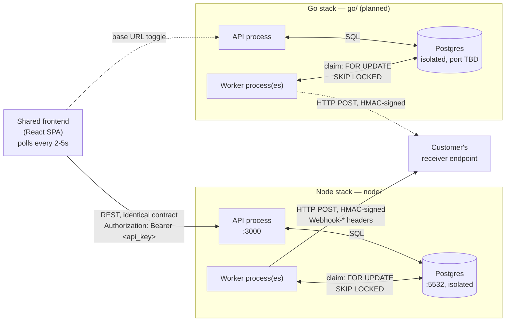
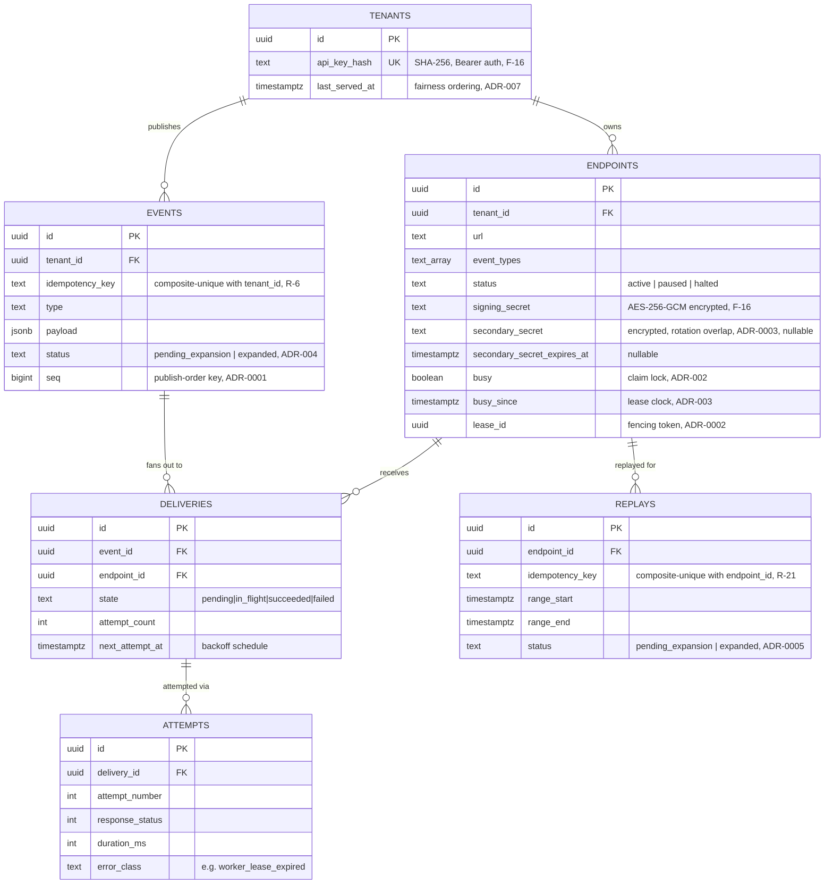
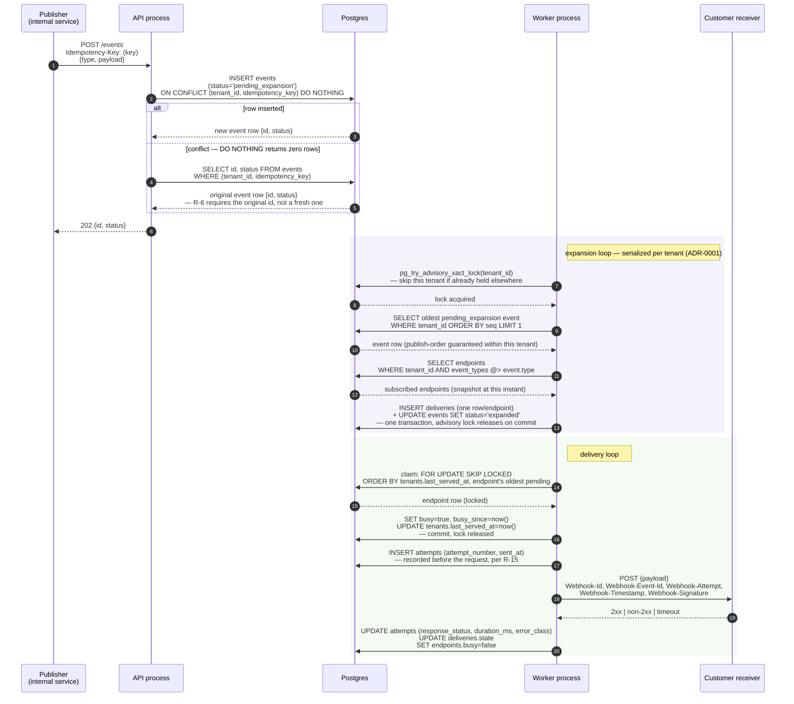
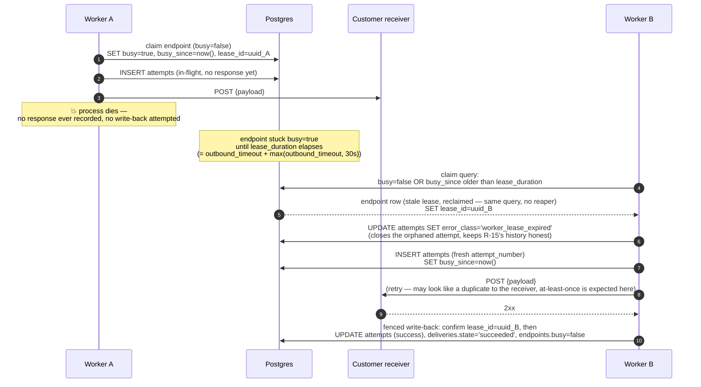
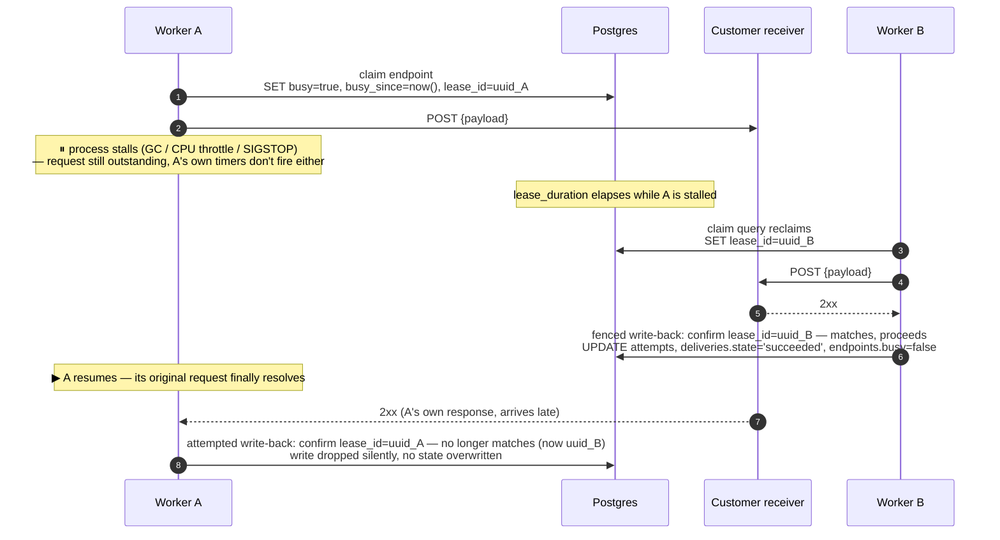
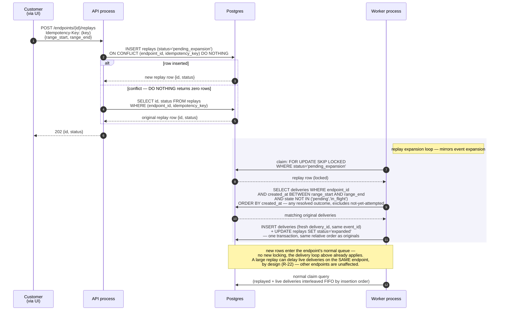
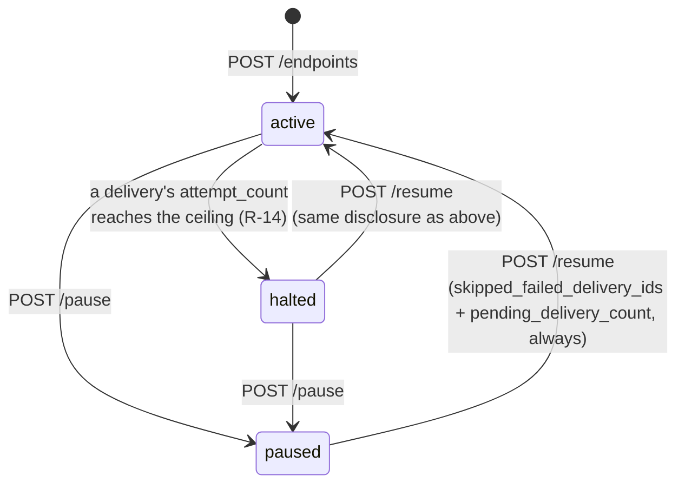
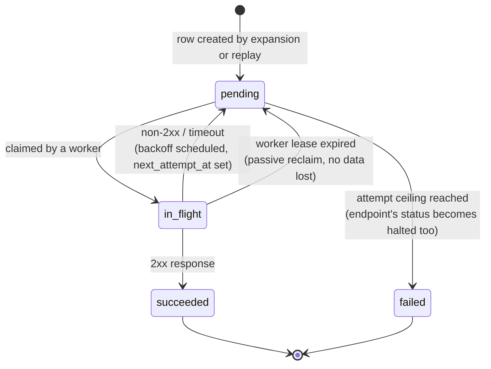

# Architecture

Structural reference for the system. For *why* each piece looks this way — alternatives
considered, trade-offs accepted — see `DECISIONS.md`. For the original requirements, see
`PRD.md`. For the take-home brief this all serves, see `CASE_STUDY.md`.

## Overview

Two backend implementations — Node.js/TypeScript (`node/`) and Go (`go/`, not yet built) — are
architecturally identical: same schema, same concurrency mechanics, same REST contract. A single
shared frontend (`frontend/`, not yet built) can point at either one via a configurable base URL.
Neither backend uses an external message broker; PostgreSQL itself is the transactional queue.



Each stack's API process and worker process(es) are separate — publish latency stays
independent of delivery throughput (R-8). Each stack has its own isolated Postgres instance so
neither implementation's load or bugs can skew the other's measurements.

## Data model

Six tables (see `node/src/db/migrations/001_init.sql` for the canonical, commented definition
— the Go schema must match it). Fields shown are the ones that carry mechanism, not the full
column list:



| Table | Purpose |
|---|---|
| `tenants` | One row per customer. `api_key_hash` (SHA-256, not plaintext) for auth, `last_served_at` for fairness ordering. |
| `endpoints` | A registered webhook target. `status` (active/paused/halted), `busy`/`busy_since`/`lease_id` (claim + fenced lease state), `signing_secret`/`secondary_secret` (rotation overlap). |
| `events` | A published event. `status` (pending_expansion/expanded), `idempotency_key`, `payload`. |
| `deliveries` | One row per (event, endpoint) pair. `state`, `attempt_count`, `next_attempt_at`. |
| `attempts` | One row per delivery attempt. Response status/body/duration/error, recorded before the request is sent. |
| `replays` | A replay request. `range_start`/`range_end`, `idempotency_key`. |

## Core mechanisms

- **Per-endpoint ordering**: a worker claims an endpoint's oldest pending delivery via a
  short-lived `FOR UPDATE SKIP LOCKED` on the endpoint row, sets `busy = true`, releases the
  lock, then makes the HTTP call outside any transaction. Order comes from the `deliveries`
  table's own insertion order — no separate sequence counter.
- **Crash recovery**: `busy_since` turns the claim into a lease. Reclaim is passive — folded
  into the same claim query (`busy = false OR busy_since` older than the lease duration) — no
  reaper process. Lease duration is derived from the outbound HTTP timeout, not an independent
  constant.
- **Async expansion**: publish inserts one `events` row and returns immediately. A shared
  worker pool later expands `pending_expansion` events into per-endpoint `deliveries` rows in
  one atomic transaction — claimed by `events.seq` under `pg_try_advisory_xact_lock(tenant_id)`,
  serializing expansion per tenant (not globally) so per-endpoint publish order survives
  concurrent workers (`docs/adr/0001`).
- **Tenant fairness**: the claim query orders candidates by `tenants.last_served_at ASC` first,
  endpoint's oldest pending delivery second — one rule gives both no-overconsumption and
  no-starvation. Bounded, not just assumed: a quiet tenant's added latency under a slow-receiver
  attack is roughly one outbound-timeout cycle, since the rule routes the next claim to the
  longest-unserved tenant as soon as any worker frees (`docs/adr/0004`). Accepted: every claim
  updates `tenants.last_served_at`, so a busy tenant's endpoints serialize claims on one hot
  row — fine at this project's target scale, a real scaling concern only past it. **Lock
  ordering invariant** (deadlock-free by construction, but only if preserved): a claim
  transaction always locks the endpoint row first (the claim query's `FOR UPDATE OF e`), then
  updates the tenant row second. Any future code that touches both an endpoint and its tenant
  row in one transaction must acquire them in that same order.
- **Retry & halt**: full-jitter exponential backoff (1s base, 2x, 30s cap, 6 attempts). At the
  ceiling, the delivery's `state` becomes `failed` and its `endpoints.status` becomes `halted`;
  deliveries are retained, not discarded.
- **Replay**: reuses the same per-endpoint queue and claim mechanism — a replay just inserts new
  `deliveries` rows (fresh `delivery_id`, same `event_id`) in original chronological order.
- **Receiver contract**: outbound requests are signed with HMAC-SHA256 over
  `"{timestamp}.{raw_body}"`, carried in `Webhook-*` headers (no legacy `X-` prefix). During a
  rotation overlap window, the request is signed once per active secret (current + secondary)
  so a receiver on either one still verifies (`docs/adr/0003`). The connection itself
  resolve-validate-pins the endpoint's IP (not a separate validate-then-connect) and follows no
  redirects, closing the DNS-rebinding and redirect-to-private-address gaps a bounded-hop-count
  policy alone doesn't (`docs/adr/0006`).

## Request flows

Each diagram labels the concrete payload at every handoff — not just "A calls B" but what A
hands B and what B hands back, since that's usually where an integration actually breaks.

### Publish → expand → deliver

The core path. Two separate worker-pool loops are shown — expansion and delivery — because
they're different transactions against different tables, even though the same physical worker
process runs both.



### Crash recovery: lease reclaim (dead worker)

Demonstrated by `make chaos` — kill a worker mid-delivery, confirm no event is lost and the
endpoint doesn't stay stuck. A killed process never reaches a write-back, so this case needs
no fencing — it's the *stall* case below that does.



### Crash recovery: fencing a stalled (not dead) worker

The bug fencing actually fixes — a killed process can't corrupt anything, but a *stalled* one
(GC pause, container CPU throttling, `SIGSTOP`) can wake up after losing its lease and still
try to write.



### Replay

Async-expanded exactly like publish (`docs/adr/0005`) — the durable ack is the single `replays`
insert, not the window query or the delivery inserts, which run later in the worker pool.



## State model

### Endpoint status

Only `active` endpoints are claimable — the delivery worker's claim query filters
`status = 'active'` (matched by `idx_endpoints_claimable`'s partial index), which is what makes
R-4's "paused endpoints accumulate deliveries rather than discarding them" actually hold: a
`paused` endpoint's deliveries just sit `pending`, never claimed, until it's active again.

`resume` states its ordering consequence — `skipped_failed_delivery_ids` plus
`pending_delivery_count` — **every time it's called, from either prior status**, not just on
the direct `halted → active` edge. Reaching `active` via `halted → paused → active` gets the
identical disclosure, since the check is keyed on delivery state, not on which status the
endpoint is resuming from (`REVIEW.md` F-12; verified live).



### Delivery state



`Blocked` (R-12/R-23) isn't a stored state — it's computed at read time as "this delivery isn't
the endpoint's current head, and the head hasn't resolved yet." See `DECISIONS.md` for why.

## Directory layout

```
/
├── CASE_STUDY.md      the assessment brief (pre-existing)
├── PRD.md             product requirements (pre-existing)
├── DECISIONS.md        architecture decisions, ~2 pages, submission format
├── ARCHITECTURE.md     this file
├── DELIVERABLES.md     what must ship and current status
├── memory-bank/        persistent context for AI sessions — read first
├── node/               Node.js/TypeScript backend (in progress)
├── go/                 Go backend (not yet started)
└── frontend/           shared React SPA (not yet started)
```

## Where the live status lives

This file describes the target shape. For what's actually built right now, see
`DELIVERABLES.md` and the wayfinder map (GitLab issue #1 in this project) — the map is the
source of truth for ticket-level progress; this file is a structural reference that shouldn't
need to change unless the architecture itself changes.
